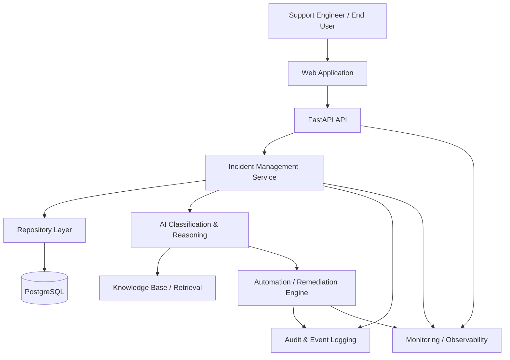

# Enterprise AI Support Platform Architecture

## 1. Purpose

This document describes the target architecture of the
Enterprise AI Support & Autonomous Incident Resolution Platform.

The platform is designed to receive IT incidents, classify them,
analyze their context, recommend or execute remediation actions,
and maintain an auditable history of the resolution process.

---

## 2. High-Level Architecture



---

## 3. Request Flow

A typical incident follows this flow:

```text
User
  |
  v
Web Application
  |
  v
FastAPI API
  |
  v
Incident Service
  |
  +----> Repository ----> PostgreSQL
  |
  +----> AI Classification
  |          |
  |          v
  |     Knowledge Base
  |
  +----> Resolution Decision
             |
       +-----+------+
       |            |
       v            v
 Auto Resolution   Human Escalation
       |            |
       +-----+------+
             |
             v
        Audit Logging
```

---

## 4. Architectural Principles

### Separation of concerns

Each layer has a specific responsibility.

```text
API Layer
    ↓
Service Layer
    ↓
Repository Layer
    ↓
Database
```

The API should not directly contain database logic.

---

### Repository abstraction

The application interacts with persistence through repository
interfaces.

This allows the implementation to change without changing
business logic.

For example:

```text
IncidentService
      |
      v
IncidentRepository
      |
      +---- InMemoryIncidentRepository
      |
      +---- PostgreSQLIncidentRepository
```

---

### Testability

Business logic should be testable independently from external
systems.

The repository abstraction allows unit tests to use an in-memory
implementation.

---

### Auditability

Important actions should produce auditable records.

Examples:

```text
Incident Created
Incident Classified
AI Recommendation Generated
Automation Started
Automation Completed
Human Escalation
Incident Resolved
```

---

## 5. Current Implementation

The project currently implements the initial foundation:

- FastAPI application
- Incident domain schemas
- Incident repository abstraction
- In-memory repository implementation
- Repository unit tests
- GitHub Issue → Branch → Pull Request workflow
- Architecture documentation

---

## 6. Future Components

The architecture will evolve to include:

1. PostgreSQL persistence
2. Authentication and authorization
3. Incident REST API
4. Service layer
5. AI-powered classification
6. Knowledge retrieval
7. Resolution recommendations
8. Automated remediation
9. Human approval workflow
10. Audit/event logging
11. Observability
12. Docker
13. CI/CD
14. Production deployment

---

## 7. Evolution Strategy

The system will be developed incrementally.

```text
Foundation
    ↓
Domain Model
    ↓
Repository
    ↓
REST API
    ↓
Service Layer
    ↓
Database
    ↓
Authentication
    ↓
AI Classification
    ↓
Knowledge Retrieval
    ↓
Resolution Engine
    ↓
Automation
    ↓
Observability
    ↓
CI/CD
    ↓
Production
```