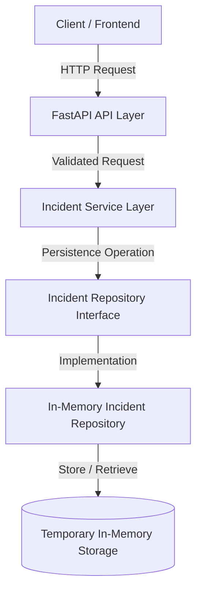

# Repository Pattern and Unit Testing

## 1. Purpose

This phase introduces the Repository Pattern and automated unit testing
for the Incident Management feature.

The goal is to separate business/application logic from data persistence.

---

## 2. Architecture

The application currently follows:

Client
  ↓
API Layer
  ↓
Service Layer
  ↓
Repository Interface
  ↓
In-Memory Repository
  ↓
Python Dictionary

The API and service layers should not directly manipulate storage.

---

## 3. Repository Pattern

The repository defines the operations required for incident persistence.

Current contract:

- create()
- get_by_id()
- list_all()

The contract is defined in:

backend/app/repositories/incident_repository.py

---

## 4. Why use a Repository?

Without a repository:

Service
  ↓
Database implementation

This creates strong coupling.

With a repository:

Service
  ↓
Repository Interface
  ↓
Implementation

The implementation can later be replaced.

For example:

InMemoryIncidentRepository
        ↓
        later
        ↓
PostgreSQLIncidentRepository

The service layer does not need to know how persistence works.

---

## 5. In-Memory Repository

The first implementation uses a Python dictionary.

Example:

{
    incident_id: incident
}

This is useful during early development because we can test the
application without introducing database infrastructure immediately.

This is temporary storage.

The production version will eventually use PostgreSQL.

---

## 6. Unit Testing

Pytest was installed in the virtual environment.

Command:

python -m pip install pytest

Tests are located at:

backend/tests/test_incident_repository.py

---

## 7. Tests Created

### Test 1 — Create Incident

Verifies that an incident can be created successfully.

### Test 2 — Get Incident

Verifies that an existing incident can be retrieved using its ID.

### Test 3 — List Incidents

Verifies that multiple incidents can be returned.

---

## 8. Test Result

Command:

python -m pytest

Result:

3 tests passed.

This confirms that the current repository implementation behaves
according to the tested requirements.

---

## 9. Important Engineering Principle

Tests should verify behavior, not implementation details.

For example:

Good:

assert created.status == IncidentStatus.NEW

Less useful:

assert repository._incidents[incident_id] == ...

The first verifies observable behavior.

---

## 10. Interview Questions

### What is the Repository Pattern?

The Repository Pattern provides an abstraction between application logic
and data persistence.

### Why use an interface?

It allows different storage implementations to follow the same contract.

### Why start with an in-memory repository?

It allows rapid development and testing before introducing database
infrastructure.

### What is unit testing?

Unit testing verifies individual components in isolation.

### Why use pytest?

Pytest provides a simple and powerful framework for writing and executing
Python tests.

### What happens when we move to PostgreSQL?

The repository implementation can be replaced with a PostgreSQL-based
implementation while keeping the higher application layers largely
unchanged.

---

## 11. Current Status

Repository contract: COMPLETE

In-memory repository: COMPLETE

Unit tests: COMPLETE

Tests passing: 3

Database integration: NOT STARTED

API integration: NOT STARTED

AI integration: NOT STARTED

## 12. Architecture Diagram

The following diagram shows how the Incident Management component is
structured and how each layer communicates with the next layer.



### Request Flow

1. A client sends an HTTP request to the FastAPI API layer.
2. The API layer receives and validates the request.
3. The request is passed to the Incident Service Layer.
4. The service communicates with the repository abstraction.
5. The repository implementation performs the persistence operation.
6. The current implementation uses temporary in-memory storage.
7. The result is returned back through the application layers.

### Why This Architecture?

The system separates responsibilities between different layers.

This reduces coupling and makes the application easier to test,
maintain, and extend.

The current in-memory repository is intentionally designed so that it
can later be replaced with a production database implementation.

For example:

```text
Current:

Service
   ↓
Repository Interface
   ↓
In-Memory Repository
   ↓
Python Dictionary


Future:

Service
   ↓
Repository Interface
   ↓
PostgreSQL Repository
   ↓
PostgreSQL Database
```

The service layer should not need to know whether the data is stored
in memory or in PostgreSQL.

This separation is an important principle of maintainable backend
architecture.